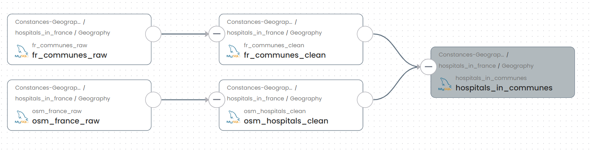

# 2. Metadata management 

There are two main parts of metadata management:
 - Gathering and loading the metadata of essential data entities(e.g. file, table, data pipeline, etc.)
 - Use the metadata to search/discover, understand and trace data.

In this seminar, we use **OpenMetadata** as the metadata management tool. Because it covers all
the functionality that **Atlas** offers. For the functionalities which **Atlas** do not offer, I will
notify you. 

## 2.1 Use the metadata to search and discover data

Here, we suppose the metadata has been already loaded into the metadata management tool. To facilitate the understanding 
of the demonstration, we reuse the scenario of `Seminar1 and Question4: Count hospitals in each commune in Île-de-France`  

Below figures shows the list of tables in this scenario:

### 2.1.1 Discover data with keywords

Suppose I am a newcomer, and all I know is that the data is about `hospital in french communes`. 

## 2.2 Use the lineage metadata to trace data provenance 

## 2.3 Collaboration (Atlas does not provide this functionality)

Announcements, tasks, Activity feed, and team conversations

## 2.4 Gathering metadata

## 2.5 Load metadata into OpenMetadata